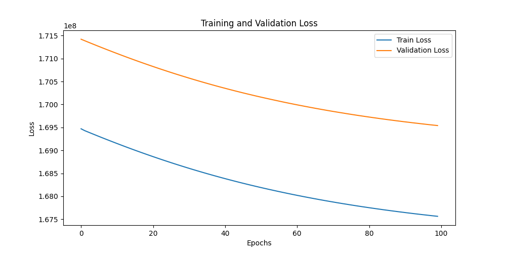
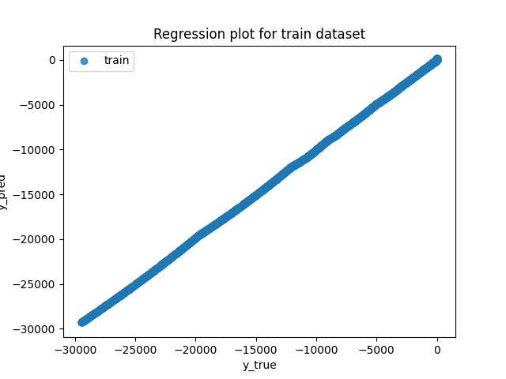
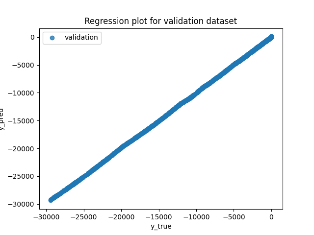
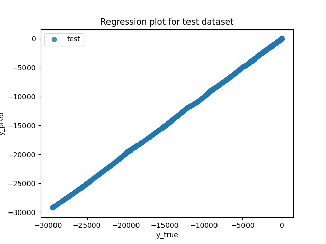
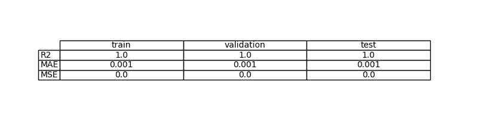
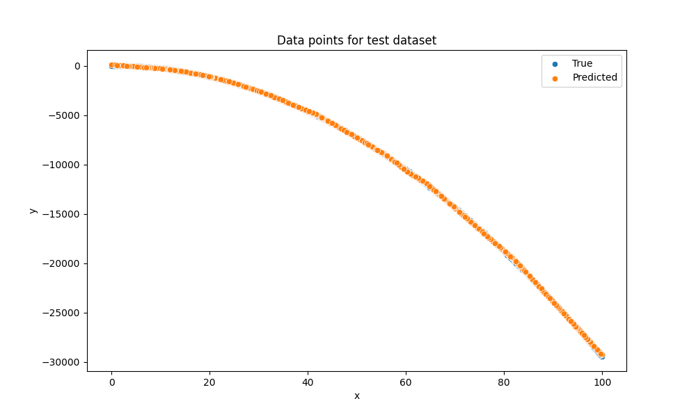

# Exercise 1: Learn a linear function with PyTorch

## Objective

Estimation of a unknown function by a machine learning model

## Task Formalization

The task is a **regression problem**. We want to learn a mapping $f(x)$ that maps an input scalar $x$ to an output scalar $y$, such that the predicted $\hat{y}$ is as close as possible to the ground truth $y$.

### Task Formalization (Inference)

Given a new, unseen input $x_{new}$, the model must predict the corresponding output $\hat{y}_{new}$.
$$\hat{y}_{new} = f(x_{new},W)$$
Where $W$ represents the learned parameters (weights and biases) of the model.
### Task Formalization (Training)

Write your answer here

## Evaluation metrics

Write your answer here

## Data Considerations

### Dataset description

We are using a dataset of recolected function output with noise, composed of $100$ samples.

### Data preparation and preprocessing

We split the data into training, validation and evaluation sets. $70\%$ of the whole dataset is used in training set, while the rest is for validation ($15\%$) and evaluation ($15\%$). To ensure the dataset is balanced we shuffle the dataset before the training.

### Data augmentation

There is no data augmentation

## Model Considerations

We need a model capable of learning a linear relationship.

### Suitable Loss Functions

**MSE and MAE Loss:** The standard loss for regression. 

### Selected Loss Function

**MSE Loss**.
It is the standard default for regression problems and generally leads to faster convergence for data with Gaussian noise.

### Possible architectures

* **Single Linear Layer:** A single neuron with a linear activation (or no activation). This is mathematically equivalent to Classical Linear Regression.
* **Multi-Layer Perceptron (MLP):** A network with hidden layers and non-linear activations.

*Selected Architecture:* **Multi-Layer Perceptron**. Since the target function is not linear, a single layer isn't sufficient.

### Last layer activation

As we want values from -inf to inf we ashall use an **identity layer** as final activation.

### Other Considerations

No other considerations were made.

## Training

We train our MLP with the following hyperparameters.

### Training hyperparameters

To train the model we are using a batch size of 10 samples, an ADAM optimizer with start learning rate of $0.0001$ and 20 epochs to avoid underfitting and overfitting.

### Loss function graph

### Discussion of the training process

The loss of training and validations decrases as epochs number increases. This means there is no overfitting.

## Evaluation

### Evaluation metrics

The results show that the prediction made by the model is working well.

Metrics for each dataset is depicted: 

### Evaluation results

Here you have examples of evaluation results for train, validation and test sets.

Example for train set:

Example for validation set:

Example for test set:

### Discussion of the results

How the model solves the problem?
The model behaves as spected solving the linear regresion of the unknown ecuation.
Is there overfitting, underfitting or any other issues? 
While the train loss decreases there is no increase in validation loss, this means the model is not learning by heart the training data so there is no overfitting. In addition, as the model loss is significantly small there isn't signs of underfitting.
How can we improve the model? How this model will generalize to new data?
The model learns how to solve the problem of the regresion function but if there was another function with the same parameters but with an offset, the model wouldn't be able to solve the problem. To solve this a convolutional model could be the best option.

## Design Feedback loops

No feedback loops were made

## Questions

Pleaser answer the following questions. Include graphs if necessary. Store the graphs in the `outs/exercise_02` folder.

### Which are the differences you found between previous model and this one?

### Does the model generalizes well to new data?

