# Exercise 3: Learn a Sinusoidal functions with PyTorch

## Objective

The objective of this exercise is to generate a neural network capable of learning a complex sinusoidal function. In this case, the function to be analised is $y(t) = 100 * sin(8\pi *x / 100) + 2 + \delta$, where delta represents uniform noise introduced into the system.

## Task Formalization

The task in hand can be formalized in two steps. First, we will define what we are tring to achieve as clearlly as possible. Second, we will define the approach we are taking to solve it.

### What we are trying to do (Inference)
There is an unknown function $f$ for which we have a bunch of data about certain input $x$ and its corresponding output $y$.

$$
y = f(x)
$$

We are trying to create a model of $f$ using a Machine Learning method to infer the $W$ weight matrix that better expreses the relationship between $x$-$y$ pair of data. Mathematically expressed:

$$
y = f(W,x)
$$

Graphically expressed:

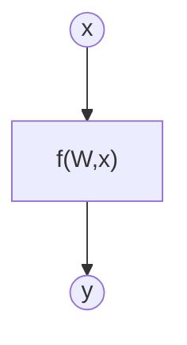
The input vector has size [100 x 1]. The weight matrix has size [1 x 1]

### How we are going to do it (Training)

The model is fed with an input x and produces a predicted output y'. Then the predicted output y' is compared with the true value y using a loss function. Finally, the model’s weights W and biases b are adjusted in a way that minimizes this loss value.

This process is repeated until the specified number of epochs is completed or until the desired loss value is reached

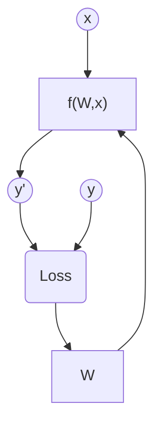

## Evaluation metrics

The problem set in this exercise is a regresion problem, so we will use the mean squared error (MSE), mean absolute error (MAE), and R-squared as evaluation metrics.

## Data Considerations

### Dataset description

Dataset contains 100 noisy data points of the function $y(t) = 100 * sin(8\pi *x / 100) + 2$, where Gaussian noise with a mean of 0 and a standard deviation of 20 has been introduced.

### Data preparation and preprocessing

The dataset was split into training (70%), validation (15%), and test (15%) sets. Also, it was also normalized before being used for training, validation, and testing.

### Data augmentation

No data augmentation has been performed.

## Model Considerations

This section explains the neural network architecture and model selection for this exercise.

### Selected Loss Function

The MSE (Mean Square Error) was selected as the loss function, because we are dealing with a regression problem. However, other types of loss functions can be used, such as MAE (Mean Absolute Error) or custom losses.

### Possible architectures

The architecture selected for this problem was a multilayer perceptron with four fully connected layers and LeakyReLU activations between them. Also, the number of neurons for each layer were 256, 128, 64 and 1 respectively.

In this case, compared to the previous exercise, more layers and neurons were added due to the complexity of approximating a sinusoidal function.

### Last layer activation

The problem solved in this exercise is a regression problem, so an Identity function was used as the last activation layer.
However, other activation functions can also be used, such as Tanh or Sigmoid. 

### Other Considerations

The described model was used in this exercise. However, any other model with enough neurons and layers, along with the correct activation functions for a regression problem, would be capable of adapting to the complexity of the sinusoidal function.

## Training

In this section, the training process used in the exercise is described.

### Training hyperparameters

The selected training hyperparameters where the next ones:

- **Number of epochs:** 80 epochs.
- **Learning rate:** $5\times10^{-5}$.
- **Batch size:** 10.
- **Optimizer:** AdamW $\rightarrow$ A modern version of the Adam optimizer that uses decoupled weight decay.

This hyperparameters were selected to reduce noise in the validation loss curve while training and the convergence of the training loss curve.

### Loss function graph

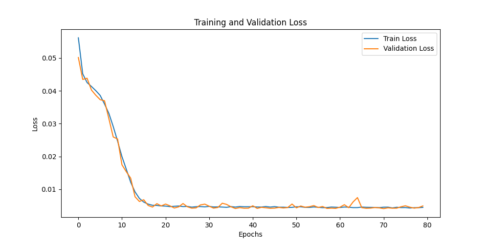

### Discussion of the training process
As it can be seen in the figure above, the training and validation loss functions decreases smoothly with no overfitting or underfitting. Also, the loss curves stabilize around the epochs 35-50, concluding that the selected hyperparameters were correct.

Additionally, the validation curve shows some fluctiations,  which introduce stochasticity into the gradient and may help the model avoid poor local minima.
## Evaluation

This section analyzes the obtained results.

### Evaluation metrics

The next plotted images are a regression diagnostic plot that compares the model’s predictions with the true target value for the datasets of training, validation and test.

**Test dataset:**
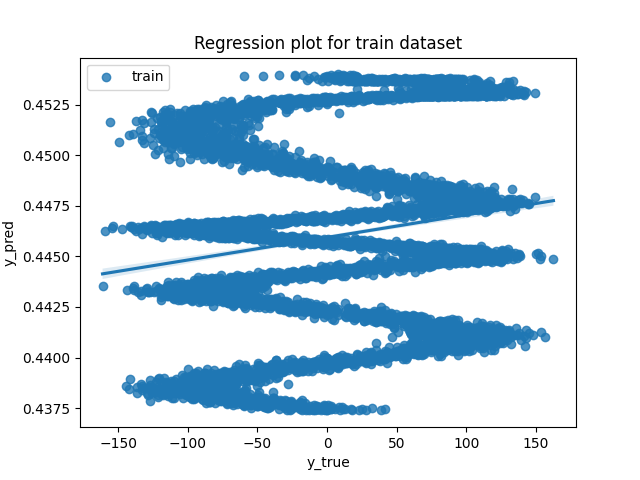

**Validation dataset:**

**Test dataset:**
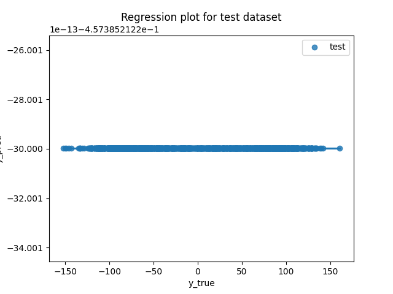

As it can be seen, the plotted points are tightly clustered around the diagonal, indicating that the model fits the given data correctly with no sign of overfitting or underfitting.

**Metrics for each dataset is depicted:**

To better analyze the obtained results, additional evaluation metrics are used: R², Mean Absolute Error (MAE), and Mean Squared Error (MSE).

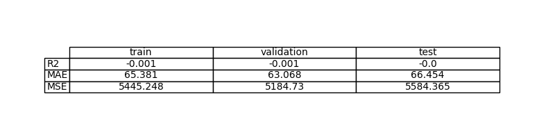

As it can be seen in the image above, the R² coefficient is approximately 0.924, indicating that the model achieves an excellent fit to the given data. In addition, the MAE and MSE values are very small, showing that the model’s prediction error is minimal.

### Evaluation results

To visualize the excellent results obtained from the evaluation metrics, the predicted values are plotted alongside the real data.

**Example for train set:**

**Example for validation set:**

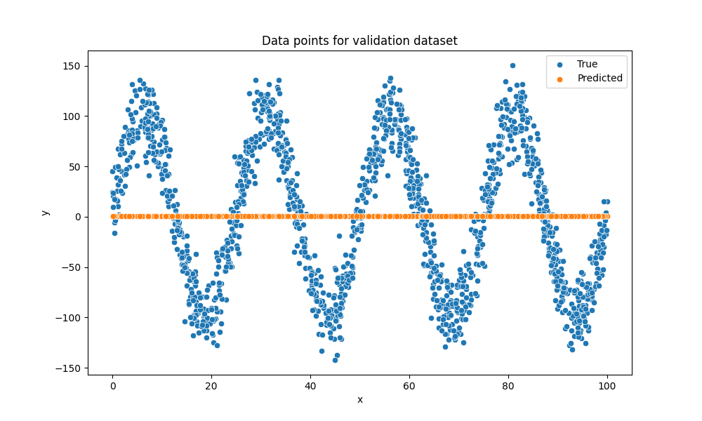

**Example for test set:**

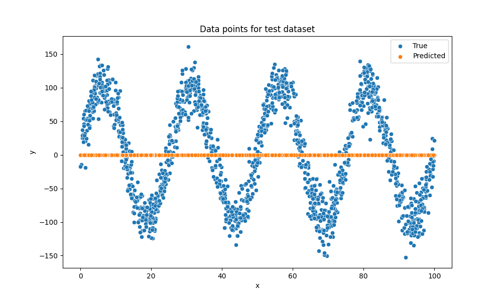

As seen in the figures, the predicted results fits correctly with the real data.
### Discussion of the results

**How the model solves the problem?**
The model solves the problem by learning the underlying sinusoidal relationship between the input and output data. During training, the neural network adjusts its weights and biases to minimize the MSE loss function, gradually refining its predictions so that they approach the true values.

**Is there overfitting, underfitting or any other issues?** With the selected hyperparameters (num_epochs=80, learning_rate=$5\times 10^{-5}$, batch_size=10, etc.), there is no overfitting, underfitting or any other issues.

**How can we improve the model?** The model can be improved by increasing its complexity, for example by adding additional layers or more neurons. Also, by modifying the optimization method or experimenting with different loss functions.

However, due to the noise introduced into the system, improving the obtained results will be difficult.

**How this model will generalize to new data?** If the new data falls within the training data (are new points of the trained sinusoidal function), the model will generalize perfectly. However, if the new data is outside the trained data (data from new function), the model will genelize poorly.

## Design Feedback loops

The feedback process done in this exercise is the next one:

- **Model with two hidden layer:** 64 and 32 respectively  
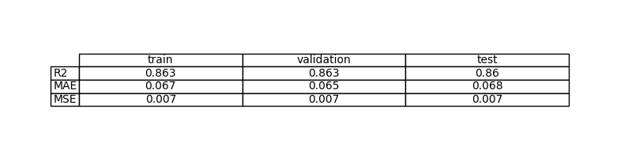

- **Model with two hidden layer:** 128 and 64 respectively

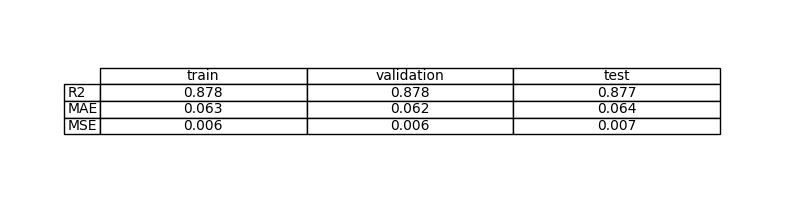
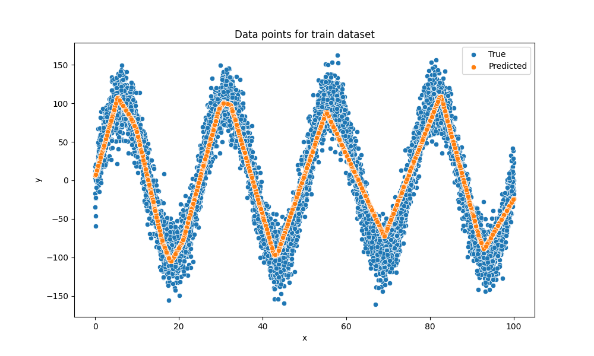

- **Selected model:** 256, 128 and 64 respectively  

## Questions

Pleaser answer the following questions. Include graphs if necessary. Store the graphs in the `outs/exercise_03` folder.

### Which are the differences you found between previous model and this one? 
The main difference is the increased complexity of this new model compared to the previous one. This model contains more layers and more neurons, which allows it to capture and predict the complexity of a sinusoidal function.

### Does the model generalizes well to new data?
As mentioned in the discussion section, the model will generalize well to new data as long as that data comes from the same function used during training. However, if the new data lies outside the training distribution (for example, coming from a different function), the model will generalize poorly.

