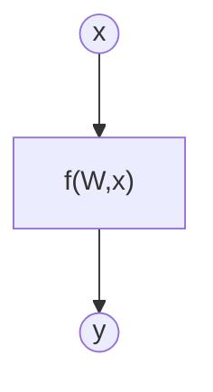
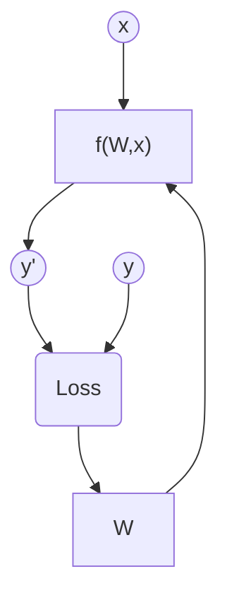

# Exercise 4: Create a Deep Learning Model for image classification in PyTorch with CIFAR-10 dataset

## Objective

The objective of this exercise is to develop a Deep Learning model that can classify images from the CIFAR-10 dataset.

In this case, we will use a Convolutional Neural Network (CNN), which will be compared with a classifier based on dense networks in Exercise 5.

Finally, the both models will be compared and their difference discused
## Task Formalization

The task in hand can be formalized in two steps. First, we will define what we are tring to achieve as clearlly as possible. Second, we will define the approach we are taking to solve it.

### What we are trying to do (Inference)
There is an unknown function $f$ for which we have a bunch of data about certain input $x$ and its corresponding output $y$.

$$
y = f(x)
$$

We are trying to create a model of $f$ using a Machine Learning method to infer the $W$ weight matrix that better expreses the relationship between $x$-$y$ pair of data. Mathematically expressed:

$$
y = f(W,x)
$$

Graphically expressed:

The input vector has size [100 x 1]. The weight matrix has size [1 x 1]

### How we are going to do it (Training)

The model is fed with an input x and produces a predicted output y'. Then the predicted output y' is compared with the true value y using a loss function. Finally, the model’s weights W and biases b are adjusted in a way that minimizes this loss value.

This process is repeated until the specified number of epochs is completed or until the desired loss value is reached

## CIFAR10 dataset
CIFAR10 is a dataset that contains 60k images, split into 50k training/validation images and 10k test images, of 10 distinct, mutually exclusive classes. 

Normally, this dataset is used as a standard benchmark for evaluating classification models.

To better understand this dataset, an example is shown below:

### Data preparation and preprocessing

The CIFAR10 dataset was split into training, validation and test, following the next porcentage.
* **Training:** 40k images (66.66...%).

* **Evaluation:** 10k images (16.66...%).
* **Test:** 10k images (16.66...%)

### Data augmentation
No data augmentation has been performed.

## Evaluation metrics
Since this exercise is a classification problem, the selected evaluation metrics are accuracy, precision, recall, and F1-score. Additionally, a confusion matrix is plotted to visualize how the predictions are distributed across the true classes.

However, other evaluation metrics for classification problems could also be used, such as balanced accuracy, specificity, or custom metrics

## Model Considerations

This section describes the selected Deep Learning model, along with the loss function, the final activation layer, and the training hyperparameters.

### Loss Functions

### Selected Loss Function

Write your answer here

### Possible architectures

Write your answer here

### Last layer activation

Write your answer here

### Other Considerations

Write your answer here

## Training

Write your answer here

### Training hyperparameters

Write your answer here

### Loss function graph

### Discussion of the training process

Write your answer here

## Evaluation

### Evaluation metrics

Write your answer here

Metrics for each dataset is depicted: 

### Evaluation results

Here you have examples of evaluation results for train, validation and test sets.

Example for train set:

Example for validation set:

Example for test set:

### Discussion of the results

How the model solves the problem?
Is there overfitting, underfitting or any other issues? 
How can we improve the model?
How this model will generalize to new data?

## Design Feedback loops

Describe the process you have followed to improve the model and the evolution of performance of the model during the process.

You can include a table stating the chanched parameters and the obtained results after the process.

## Questions

Pleaser answer the following questions. Include graphs if necessary. Store the graphs in the `outs/exercise_03` folder.

### Which are the differences you found between previous model and this one?

### Does the model generalizes well to new data?

