# Exercise 4: Create a Deep Learning Model for image classification in PyTorch with CIFAR-10 dataset

## Objective

The objective of this exercise is to develop a Deep Learning model that can classify images from the CIFAR-10 dataset.

In this case, we will use a Convolutional Neural Network (CNN), which will be compared with a classifier based on dense networks in Exercise 5.

Finally, the both models will be compared and their difference discused
## Task Formalization

The task in hand can be formalized in two steps. First, we will define what we are tring to achieve as clearlly as possible. Second, we will define the approach we are taking to solve it.

### What we are trying to do (Inference)
There is an unknown function $f$ for which we have a bunch of data about certain input $x$ and its corresponding output $y$.

$$
y = f(x)
$$

We are trying to create a model of $f$ using a Machine Learning method to infer the $W$ weight matrix that better expreses the relationship between $x$-$y$ pair of data. Mathematically expressed:

$$
y = f(W,x)
$$

Graphically expressed:

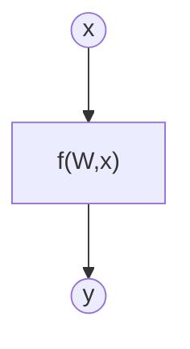
The input vector has size [100 x 1]. The weight matrix has size [1 x 1]

### How we are going to do it (Training)

The model is fed with an input x and produces a predicted output y'. Then the predicted output y' is compared with the true value y using a loss function. Finally, the model’s weights W and biases b are adjusted in a way that minimizes this loss value.

This process is repeated until the specified number of epochs is completed or until the desired loss value is reached

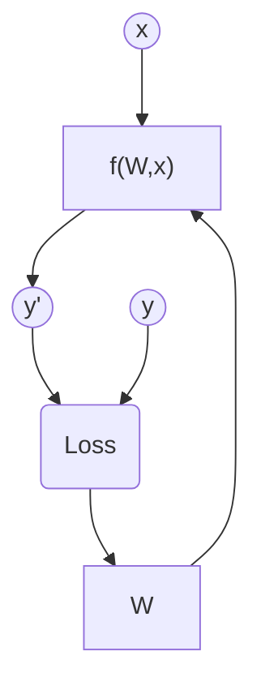

## CIFAR10 dataset
CIFAR10 is a dataset that contains 60k images, split into 50k training/validation images and 10k test images, of 10 distinct, mutually exclusive classes. 

Normally, this dataset is used as a standard benchmark for evaluating classification models.

To better understand this dataset, an example is shown below:

### Data preparation and preprocessing

The CIFAR10 dataset was split into training, validation and test, following the next porcentage.
* **Training:** 45k images (75...%).

* **Evaluation:** 5k images (8.33...%).
* **Test:** 10k images (16.66...%)

### Data augmentation
No data augmentation has been performed.

## Evaluation metrics
Since this exercise is a classification problem, the selected evaluation metrics are accuracy, precision, recall, and F1-score. Additionally, a confusion matrix is plotted to visualize how the predictions are distributed across the true classes.

However, other evaluation metrics for classification problems could also be used, such as balanced accuracy, specificity, or custom metrics

## Model Considerations

This section describes the selected Deep Learning model for image classification, including the loss function, final activation layer, and training hyperparameters.

### Loss Functions

The selected loss function was Cross-Entropy, since the task is a classification problem. However, other custom loss functions specifically designed for classification tasks could also be used.

### Possible architectures

The architecture selected for this problem was a Convolutional Neural Network (CNN) composed of two main blocks. Each block consists of a Convolutional layer, followed by a ReLU activation function and a MaxPooling layer. After these blocks, a flattening operation is applied, followed by a fully connected network and a final Softmax activation layer.

Additionally, a modified version of the VGG network adapted to the CIFAR-10 image size (32×32) was also implemented.

### Last layer activation

As final activation layer a Softmax function is used. This choice is appropriate for multiclass classification problems, such as CIFAR-10, which transforms the likelihood of each class between 0 and 1, ensuring that the sum of predicted probabilities is exactly 1.0 (or 100%).

### Other Considerations

The presented architectures were used for this exercise. However, any other architecture, for regresion problems, could be used. The only requirement is that the model must be sufficiently complex to capture the underlying patterns in the data, but not overly complex in order to avoid overfitting.

## Training

In this section, the training process used in the exercise is described.

### Training hyperparameters

The selected training hyperparameters where the next ones:

- **Number of epochs:** 80 epochs.
- **Learning rate:** $1\times10^{-4}$.
- **Batch size:** 32.
- **Optimizer:** AdamW $\rightarrow$ A modern version of the Adam optimizer that uses decoupled weight decay.

These hyperparameters were selected to accelerate training convergence while improving stability and introducing some stochasticity into the gradient, reducing the risk of getting trapped in local minima.

### Loss function graph

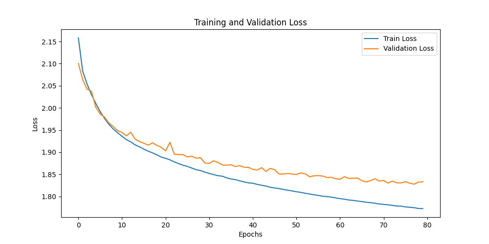

### Discussion of the training process

As it can be seen in the figure above, the training and validation loss functions decreases smoothly with no overfitting or underfitting. However, the validation loss curves starts to stabilize around the epochs 60-80, indicating that first signal of overfit if the model is trainned with more epochs.

## Evaluation
This section analyzes the obtained results.

### Evaluation metrics

The obtained confution matrix for test is the next ones:

**Training Confution Matrix:**

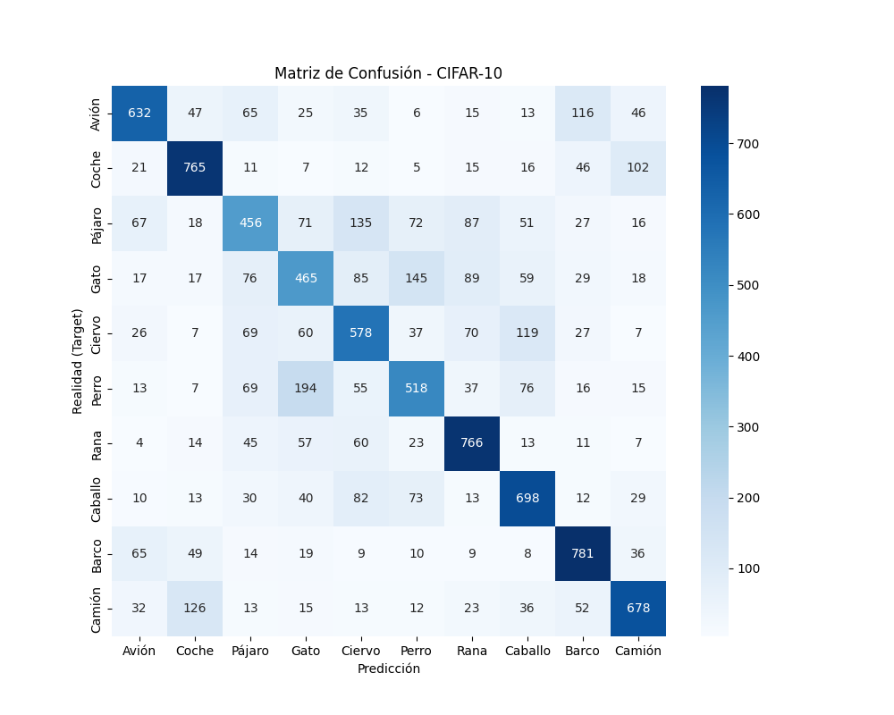

**Validation Confusion Matrix:**

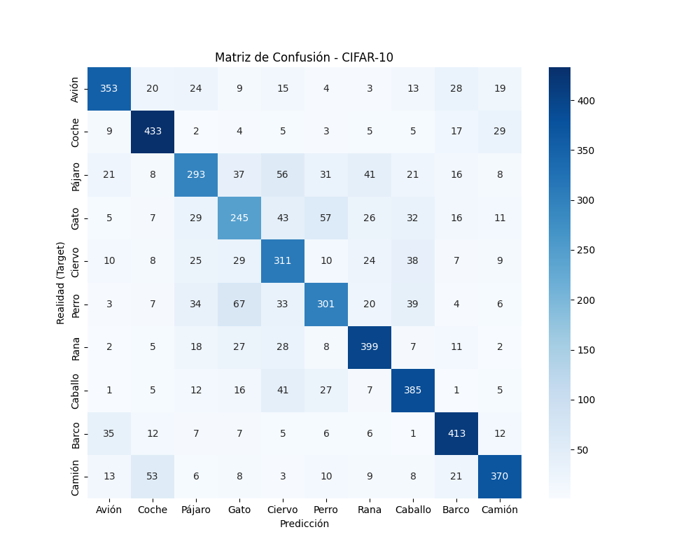

**Test Confusion Matrix:**

The metrics for each dataset are presented below.

**Training Metrics:**

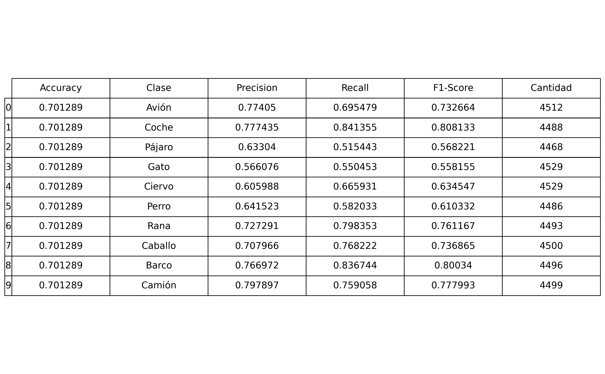

**Validation Metrics:**

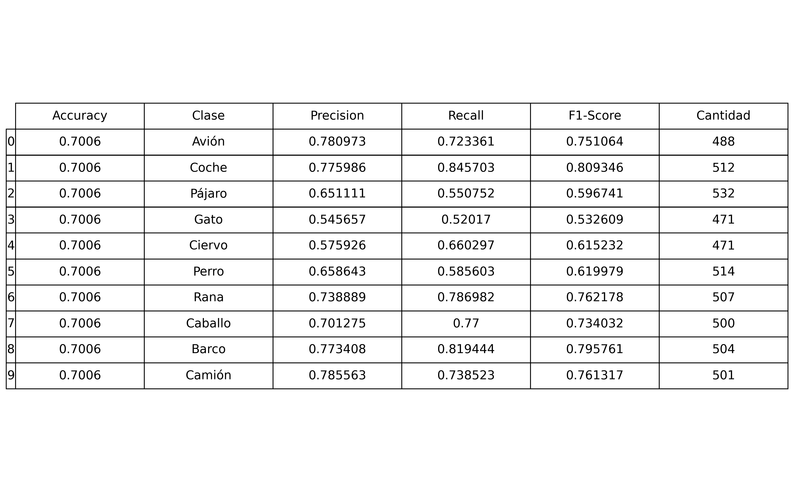

**Test Metrics:**

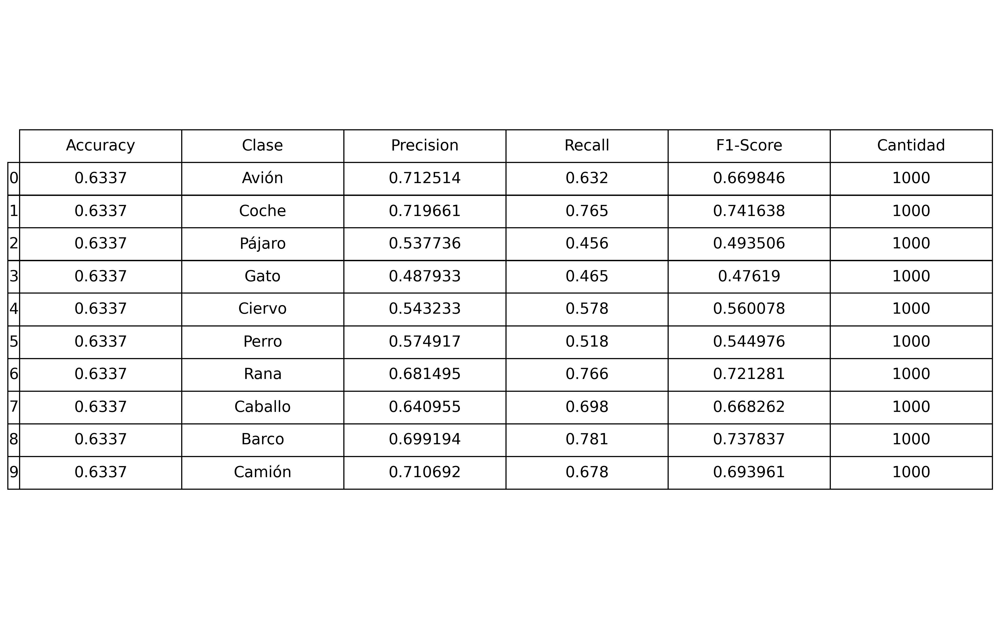

### Evaluation results

As it can be seen in the evaluation metrics section, the obtained results are satisfactory, although not particularly impressive. The models has an accurary around 60%, a precision between 55%-70%, a recall between 45%-70% and a F1-Score around 50%-70%, which are expected values for a standard CNN-based classification model.

### Discussion of the results

**How the model solves the problem?** The model solves the problem by learning the underlying features of each image and classifying them into one of the 10 categories. During training, the Deep Learning model adjusts its weights and biases to minimize the Cross-Entropy loss function. Through this process, it gradually learns better feature representations and refines its predictions to align with the ground-truth labels.

**Is there overfitting, underfitting or any other issues?** As discussed in the training and evaluation section, there weren't any overfitting or underfitting issues. However, the model started to show the first signs of overfitting.

**How can we improve the model?** The model can be improved by increasing its complexity, allowing it to extract more sophisticated feature representations. One effective approach would be to incorporate additional convolutional layers, which enables the network to learn deeper, more hierarchical patterns within the data.

**How this model will generalize to new data?** If the new data corresponds to the CIFAR-10 dataset, the model will generalize correctly. However, if new data from a different dataset is used, containing different classes, the model will generalize poorly.

## Design Feedback loops

The feedback process done in this exercise is the next one:

### Convolutional Neural Network (1 Block):
Initially, we began with a simple, single-block Convolutional Neural Network. This model consisted of a convolutional layer with 32 filters, followed by a Max Pooling layer and a ReLU activation function.

The test results obtained were as follows:

* **Confusion Matrix:**

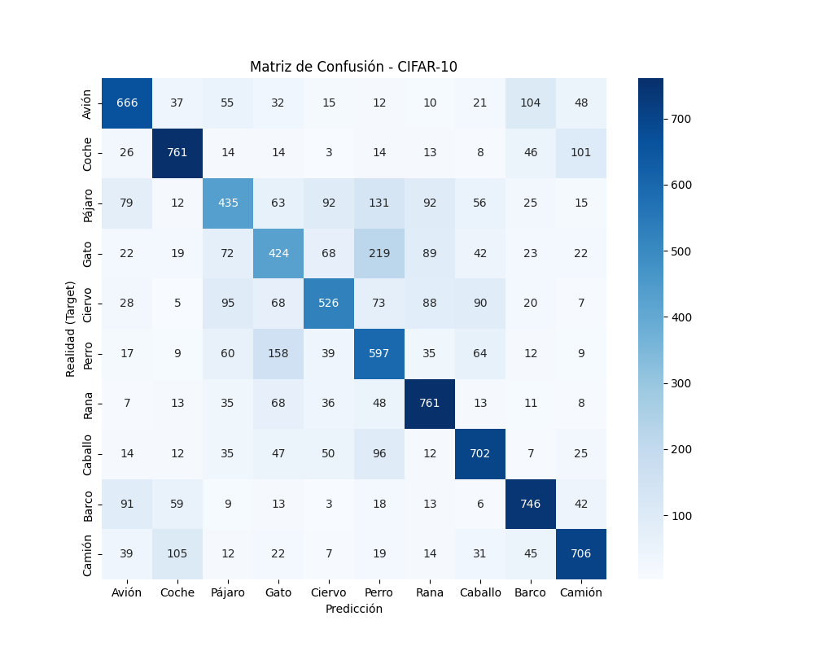

* **Evaluation Metrics:**

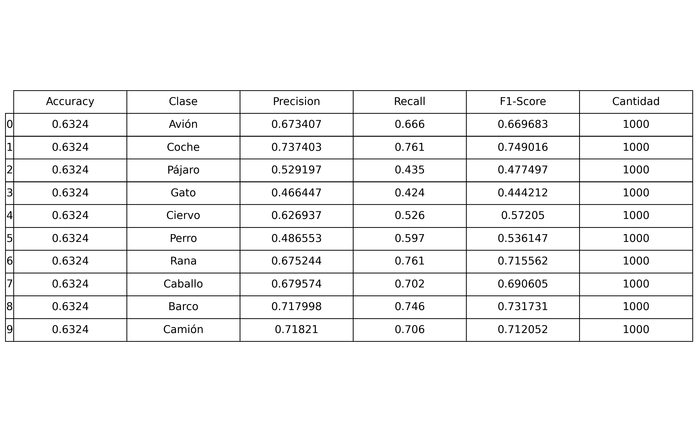

### Convolutional Neural Network (2 Block):
Next, we used the discribed model of this exercise. Where we add a little bit more of complexity incorporating an additional convolutional block.

The results were shown above.

### VGG implentation:
Finally, we implemented the VGG-style model for the CIFAR10 dataset. 

This model contained three convolutional blocks, each using ReLU activation functions and Max Pooling layers, as mentiones in page 54 of the Convolution Neural Network PDF.

The test results obtained were as follows:

* **Confusion Matrix:**

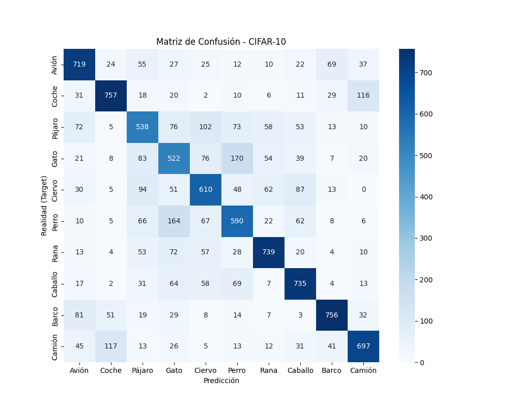

* **Evaluation Metrics:**

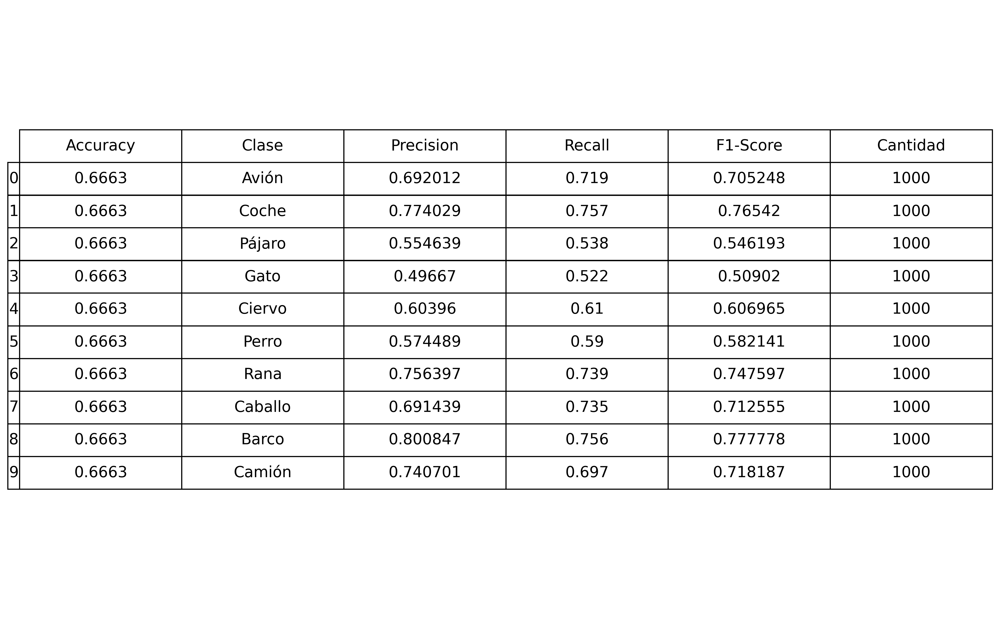
## Questions

Pleaser answer the following questions. Include graphs if necessary. Store the graphs in the `outs/exercise_03` folder.

### Which are the differences you found between previous model and this one? 
The main difference between this model and the previous one is the architecture. In this case, we used Convolutional Layer, which are capable of extracting the main feature from the data, adapting to variations in orientation and translation.

Also, the used input are RGB 32x32 images, which corresponds to an input of dimension (3,32,32), instead of the scalar input used in exercise 3.

### Does the model generalizes well to new data? 
As mentioned in the Results and Discussion section, the model will generalize to new data only if that data is from the CIFAR-10 dataset. If the data originates from a different distribution, the model will fail to generalize.

