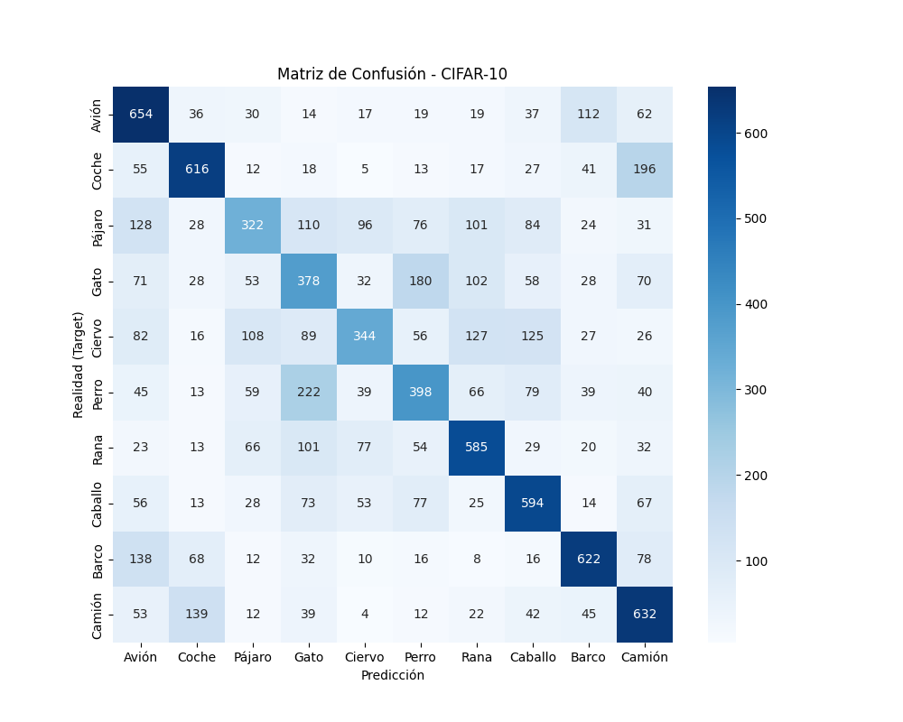
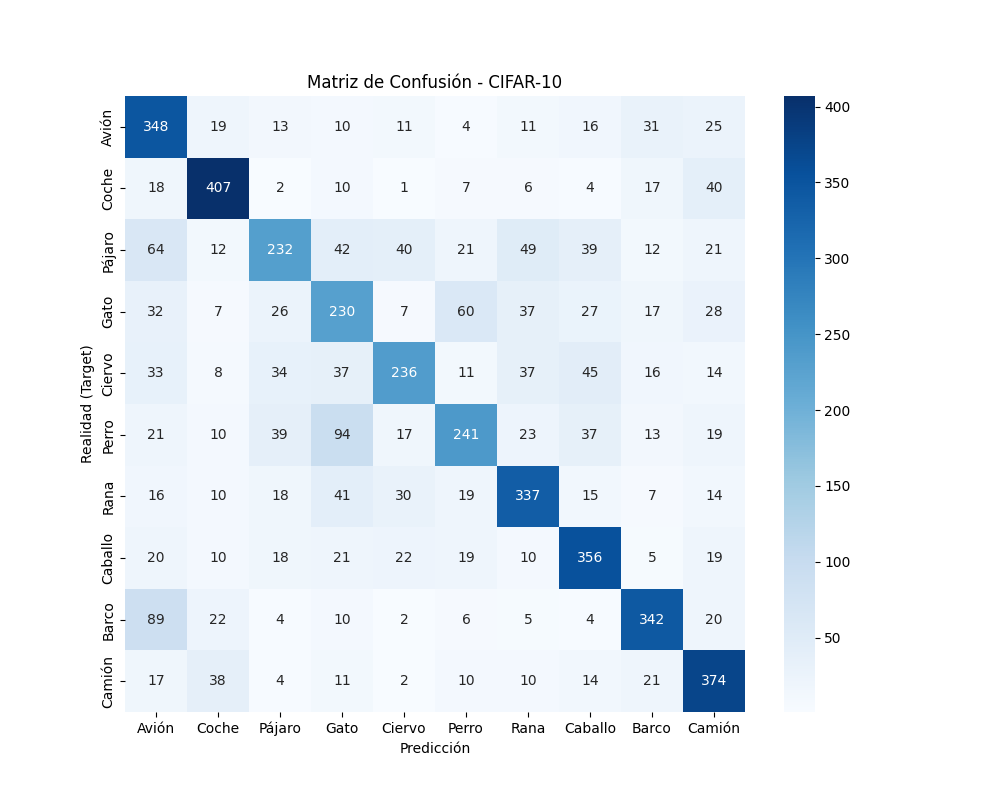
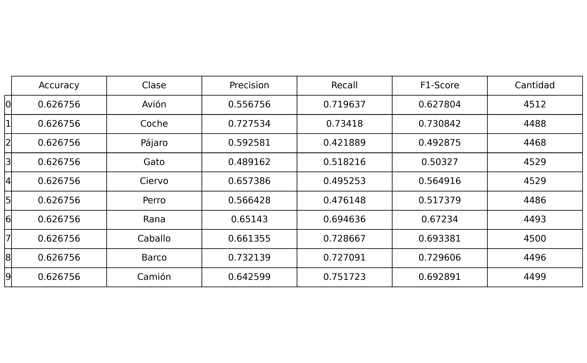
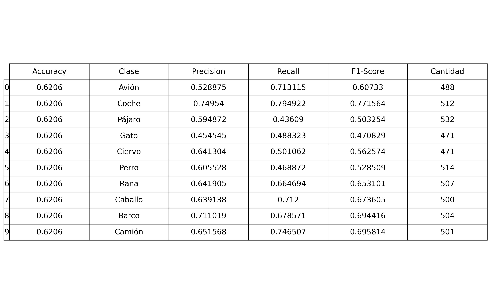
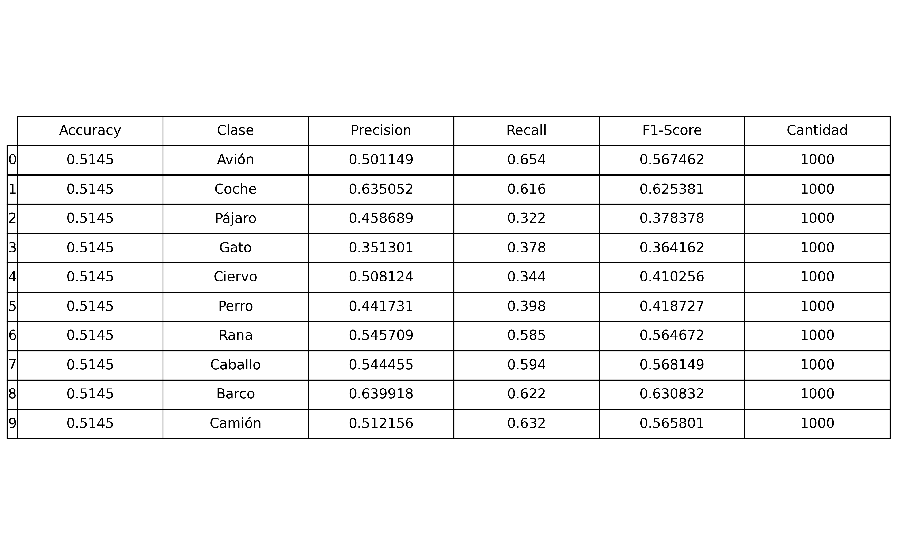

# Exercise 5: Create a Deep Learning Model for image classification in PyTorch with CIFAR-10 dataset

## Objective

Develop a model that can classify images from CIFAR-10 dataset

First try a model only with fully connected layers
Create an evaluate.py file that evaluates the model and calculates and stores the evaluation metrics including a confusion matrix

Which are the conclussions?

## Task Formalization

The task consists of a **Multi-Class Image Classification** problem. The goal is to approximate a mapping function that assigns an input image to one of the  mutually exclusive categories in the set 

The model is contrained to use **only fully connected layers** (a Multi-Layer Perceptron) The model treats the image as a set of independent pixel intensities rather than a spatial map.

### Task Formalization (Inference)

During the inference phase, the trained model processes new, unseen images to predict their class labels. First, the input image (a 32×32 RGB tensor) is preprocessed and flattened into a single vector of 3,072 numerical features. This vector is then fed into the fully connected network, where it passes through a series of matrix multiplications and non-linear activation functions. The final layer outputs a vetor of size 10, which is converted into probabilities using a Softmax function. The system then selects the class index with the highest probability as the final predicted category for that image.

### Task Formalization (Training)

During training, the system optimizes the network parameters to minimize prediction error. The model processes batches of images, normalizing the activations of each layer using Batch Normalization to stabilize learning and accelerate convergence. To prevent overfitting a dropout layer is applied, randomly deactivating a fraction of neurons during each forward pass (redundancy). The network then calculates the Categorical Cross-Entropy loss between the predicted probabilities and the true labels. Finally, an optimizer updates the weights via backpropagation based on the computed gradients.

## Evaluation metrics

The `evaluate.py` script measures the model's performance on the Training, Validation, and Test datasets using three components:

* **Accuracy:** Calculates the overall percentage of images that were correctly classified.
* **Confusion Matrix:** Generates a heatmap visualization to show exactly which classes are being confused with each other (e.g., if the model frequently mistakes "Cats" for "Dogs").
* **Per-Class Metrics:** Computes **Precision**, **Recall**, and **F1-Score** for each of the 10 classes to see if the model performs better on some objects than others.

The script automatically saves these results as **CSV files** (data) and **PNG images** (visual tables and heatmaps) for easy reporting.

## Data Considerations

### Dataset description

CIFAR10 is a dataset that contains 60k images, split into 50k training/validation images and 10k test images, of 10 distinct, mutually exclusive classes. 

Normally, this dataset is used as a standard benchmark for evaluating classification models.

### Data preparation and preprocessing

The CIFAR10 dataset was split into training, validation and test, following the next porcentage.
* **Training:** 45k images (75...%).
* **Evaluation:** 5k images (8.33...%).
* **Test:** 10k images (16.66...%)

### Data augmentation

No data augmentation was considered

## Model Considerations

This section describes the selected Deep Learning model for image classification, including the loss function, final activation layer, and training hyperparameters.

### Selected Loss Function

The selected loss function was the Categorical Cross-Entropy, since the task is a multiclass classification problem. 

### Possible architectures
The task is set to use only dense layers so the architecture is of a **Multy Layer Perceptron**

### Model Architecture Explanation

The implemented model is a **Multilayer Perceptron (MLP)** designed to classify images by flattening them into a 1D vector. The architecture consists of a sequence of **3 hidden blocks** that reduce the dimensionality of the data in every layer, followed by a final output layer.

**Structure Breakdown:**

1.  **Input Processing:**
    The input image ($32 \times 32 \times 3$) is flattened into a single vector of **3,072** features.

2.  **Layer Components:**
    Each hidden block applies the following operations in order:
    * **Linear:** Standard matrix multiplication (weights).
    * **ReLU:** Activation function to introduce non-linearity.
    * **Batch Normalization:** Normalizes outputs to stabilize training.
    * **Dropout (20%):** Randomly deactivates neurons to prevent overfitting.

3.  **Hidden Layers (Feature Extraction):**
    The network compresses the information through three sequential blocks:
    * **Block 1:** $3072 \to 512$ neurons.
    * **Block 2:** $512 \to 256$ neurons.
    * **Block 3:** $256 \to 128$ neurons.

4.  **Output:**
    The final layer maps the last $128$ features to the **10 output classes** ready for classification.

### Last layer activation

We use a **Softmax activation** layer of one dimension because the multiclass clasification problem requires that the probability of each class is bounded so the sum of every probability don't exceed 1. 
### Other Considerations

Another activations that fulfill the consideration above could be valid as a last layer activation.

## Training hyperparameters
The selected training hyperparameters where the next ones:

- **Number of epochs:** 80 epochs.
- **Learning rate:** $1\times10^{-6}$.
- **Batch size:** 2024 (CUDA).
- **Optimizer:** AdamW $\rightarrow$ A modern version of the Adam optimizer that uses decoupled weight decay.

In the training process the backpropagation returns the gradient of the net and the ADAMW optimizer upgrades the parameters of the net. As we are using a gpu to train the net is better to consider big batch sizes. The initial learning rate is set to $1E-6$. Then the ADAMW optimizer calculates the best learning rate depending of the loss function.

### Loss function graph
The train loss and validation loss function evolutions are showed in the next graph.

### Discussion of the training process

For 80 epochs there is no notable overfitting as validation loss continues to decrease for every epoch. While train loss still decreases and validation loss doesn't reach a global minimun the model can be trained for more epochs without suffering from overfitting.

## Evaluation
This section analyzes the obtained results.
### Evaluation metrics
The obtained confution matrix for test is the next ones:

**Training Confution Matrix:**

**Validation Confusion Matrix:**

**Test Confusion Matrix:**

The metrics for each dataset are presented below.

**Training Metrics:**

**Validation Metrics:**

**Test Metrics:**

### Evaluation results

As it can be seen in the evaluation metrics section, the obtained results are satisfactory, but worse than the convolutional models. The model has an accurary around 50% for the test set, a precision between less than %63 for the better fitted class, a recall between 32%-65% and a F1-Score around 36%-63%. This results were expected to be worse than the CNN models.

### Discussion of the results

How the model solves the problem?
The model solves the problem with less acuracy than the previous models
Is there overfitting, underfitting or any other issues? 
There is no overfitting in the 80 epochs training. This means that better results could be obtained if the model was trained for more epochs until validation loss starts to grow.
How can we improve the model?
More layers don't improve the model because when there are too many layers the model doesn't upgrade properly the weights and starts to biasing every set of data. The only reasonable way to improve the model is to add more epochs to the train process due to unseen validation grow.
How this model will generalize to new data?
This model will generalize bad to new data. This is because the MLP doesn't learn to extract characteristics as the CNN network does. So if we change the dataset by introducing transformations as rotations in the images, the model would lose the prediction accuracy. However, in the CNN models the feature extraction survives this kind of transformations. So if we want to generalize to new data we have to other architectures.

## Design Feedback loops

Firsly we tried to add multiple layers to improve the model, but as said, more layers implied worse predictions. This is due to a poor propagation of the gradient: Too many layers became imposible to fit for the optimizer, and the net becames incapable of the task. To avoid this we reduced layers. Then we improved the data comprimation for every layer (3072->512->256->128->10) to ensure there is no great information loss. Finally we add some dropout and batch normalization layers to reduce overfitting and improve the accuracy. Applying the feedback loops we reached to the model evaluated.

